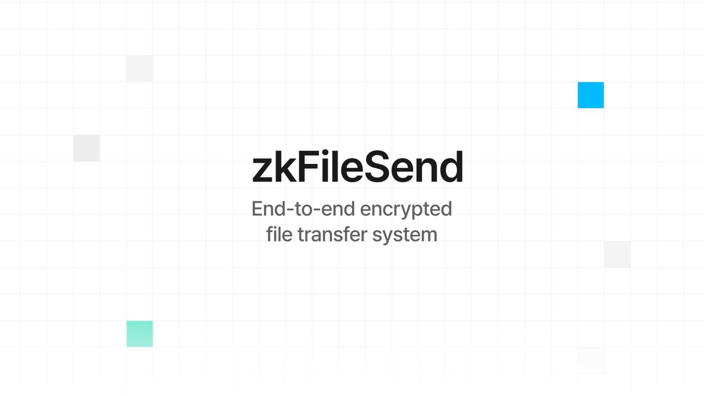
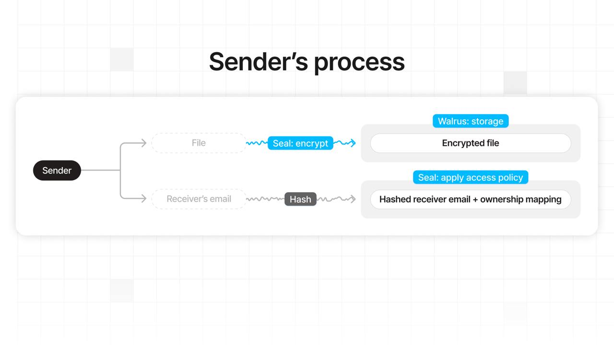
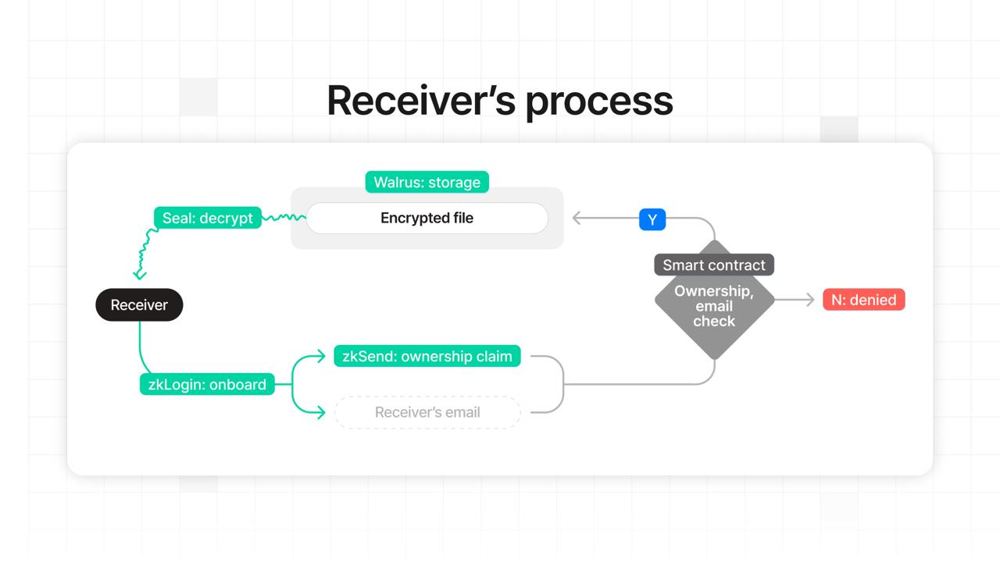
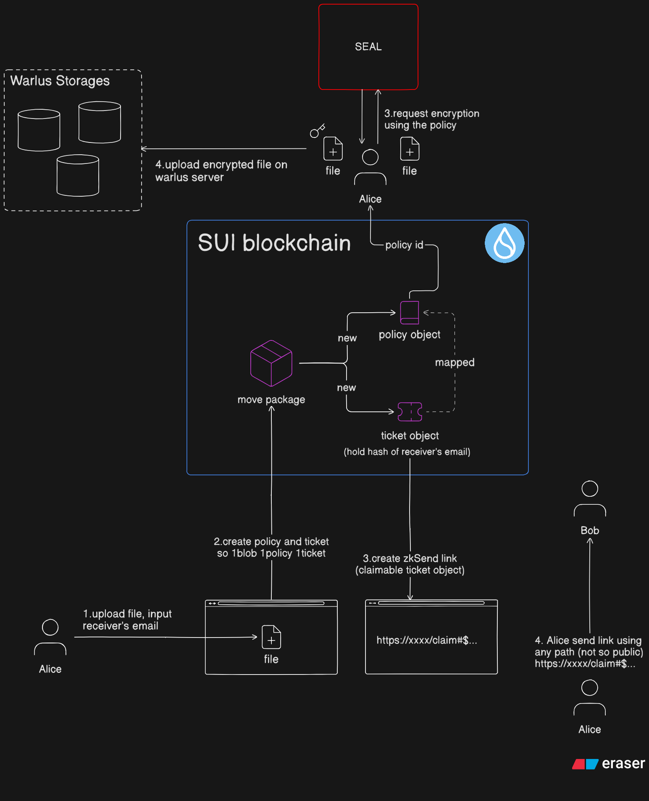
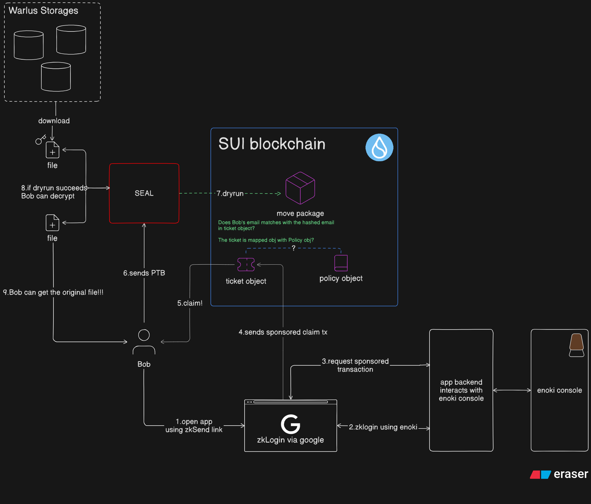

# zkFileSend 🔐

> End-to-End Encrypted Decentralized File Transfer using Sui Frameworks 🔒

---

## Overview 🧭

`zkFileSend` combines multiple frameworks in the **Sui ecosystem** to build a fully decentralized, end-to-end encrypted file transfer system.  
Users can safely send and receive files without relying on centralized intermediaries.

- Problem: ⚠️ Hacks targeting customer data — and even unauthorized surveillance by tech companies — are still happening today. For confidential files, use an end-to-end encrypted file transfer system where only the sender and the authorized receiver can access the data.
- Solution: 🛡️ zkFileSend runs on the Sui blockchain, leveraging Walrus, Seal, zkLogin, and zkSend to enable fully end-to-end encrypted file transfers. Files are encrypted so that only the authorized receiver chosen by the sender can open and download them after passing an access check.
- Impact: 🎯 Only the sender and the authorized receiver can access the file — no one else can see it, not even Sui/Walrus validators.

There are two types of users:

1. **File Sender** 📤  
   - Encrypts the file and uploads it to decentralized storage.  
   - Generates a claimable link that allows the recipient to decrypt the file.

  

2. **File Receiver** 📥  
   - Downloads the encrypted file from decentralized storage.  
   - Decrypts the file after passing authorization checks.

  

---

## Technologies Used 🛠️

- **[Walrus](https://github.com/MystenLabs/walrus)** → Decentralized blob storage. 🗄️  
- **[Seal](https://seal-docs.wal.app/)** → Encryption/decryption key and access policy framework. 🔐  
- **Sui Move Contracts** → Manage Seal decryption policies on-chain (`content_gate_keeper` package). 📜  
- **[zkSend](https://github.com/MystenLabs/zkSend)** → Generates claimable links for ticket objects. 🔗  
- **[zkLogin](https://arxiv.org/abs/2401.11735)** → Simplifies onboarding for recipients without a Sui wallet. 🔑  

---

## Process 🔄

### File Sender Flow 📤

1. Connect Sui wallet.  
2. Upload file to the client app and specify recipient’s email.  
3. Call `new_policy` in the Move package `content_gate_keeper` to create:  
   - A **policy object**.  
   - A **ticket object** bound to that policy.  
4. Generate a **zkSend link** from the ticket object ID and share it off-chain.  

---

### File Receiver Flow 📥

1. Receive the zkSend link off-chain and click it.  
2. App launches and performs **zkLogin** (if user has no Sui wallet).  
3. Claim the ticket object via **zkSend**.  
4. Run **Seal Challenge**:  
   - Verify the recipient owns the ticket object.  
   - Ensure the hashed email in the ticket matches the zkLogin email hash.  
5. Upon success:  
   - Download the encrypted file from **Walrus**.  
   - Decrypt using Seal to obtain the original file.  

---

## Architecture 🏗️

- **Sender:** Uploads → Creates policy/ticket → Issues zkSend link. 📤  
- **Receiver:** Claims ticket → Passes Seal challenge → Downloads & decrypts. 📥  
- **Smart Contract Layer:** `content_gate_keeper` manages access policies. 🧠  
- **Storage Layer:** Walrus stores encrypted blobs. ☁️  
- **Authentication Layer:** zkLogin ensures easy onboarding with existing accounts. 🔐

# Demo 🎬

 
 Click the image to watch the demo on YouTube.

Thank you for watching! 🙏
Also thank you for all sui developers for your hard work and support! 🙏
