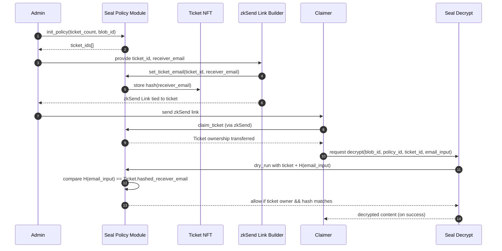

```mermaid
sequenceDiagram
    autonumber
    participant Admin as Admin
    participant Policy as Seal Policy Module
    participant Ticket as Ticket NFT
    participant Builder as zkSend Link Builder
    participant Claimer as Claimer
    participant Seal as Seal Decrypt

    Admin->>Policy: init_policy(ticket_count, blob_id)
    Policy-->>Admin: ticket_ids[]

    Admin->>Builder: provide ticket_id, receiver_email
    Builder->>Policy: set_ticket_email(ticket_id, receiver_email)
    Policy->>Ticket: store hash(receiver_email)
    Builder-->>Admin: zkSend Link tied to ticket

    Admin->>Claimer: send zkSend link
    Claimer->>Policy: claim_ticket (via zkSend)
    Policy-->>Claimer: Ticket ownership transferred

    Claimer->>Seal: request decrypt(blob_id, policy_id, ticket_id, email_input)
    Seal->>Policy: dry_run with ticket + H(email_input)
    Policy->>Policy: compare H(email_input) == Ticket.hashed_receiver_email
    Policy-->>Seal: allow if ticket owner && hash matches
    Seal-->>Claimer: decrypted content (on success)
```
